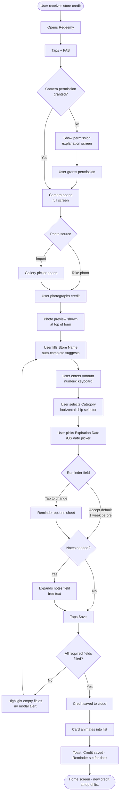
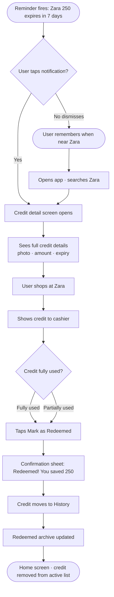
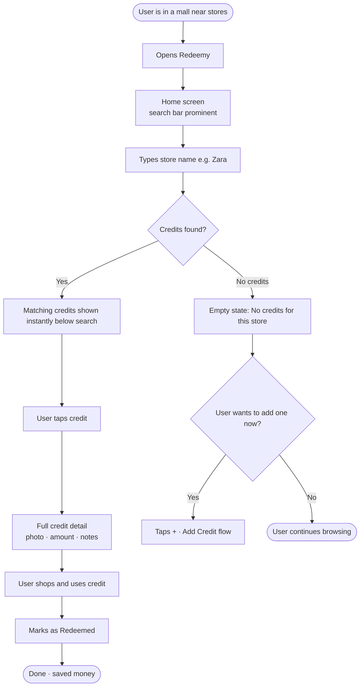
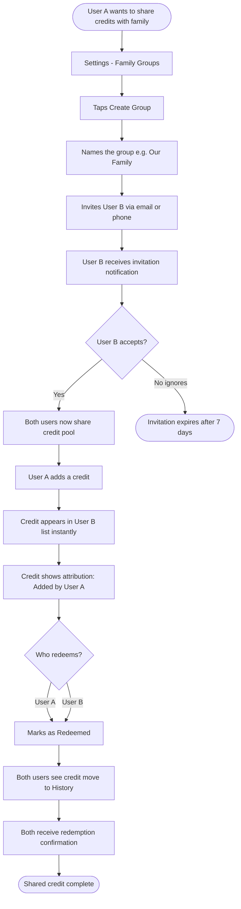

# UX Design Specification Redeemy

**Author:** Moti
**Date:** 2026-04-16

---

<!-- UX design content will be appended sequentially through collaborative workflow steps -->

## Core User Experience

### Defining Experience

The defining experience of Redeemy is **capture and forget** — users add a credit in seconds and trust the app to remind them at the right moment. The burden of remembering moves entirely to the app; the user's only job is to photograph and fill in a few fields once.

The **Add Credit flow** is the make-or-break interaction. Everything else — browsing, searching, redeeming — serves users who have already built the habit. The Add Credit flow *creates* that habit. It must feel faster than any alternative (texting yourself a reminder, taking a note, hoping to remember).

**Shopping discovery** is the primary home screen experience — the moment users open the app while in a mall or store to answer one question: "do I have a credit here?" This positions Redeemy as a tool used in the real world, not just at home while organizing.

### Platform Strategy

- **Primary platform:** iOS-first (iPhone), Android secondary — same codebase, full parity
- **Framework:** React Native with Expo — native iOS feel, large ecosystem, mature camera/image libraries, broader developer talent pool
- **Web companion:** A web-accessible view showing **missed credits** (expired without redemption) — serves as a reflection and re-engagement surface, motivating users to keep the app up to date so future credits aren't lost the same way
- **Input:** Touch-first, thumb-optimized, one-handed usability on the credit list and detail views
- **Connectivity:** Internet connection required to add a credit (cloud sync on save); reading and browsing credits works offline
- **iOS target:** iOS 15+; leverages iOS native date picker, share sheet, and notification APIs

### Effortless Interactions

These interactions must require **zero conscious thought** from the user:

- **Photo first** — Add Credit opens the camera immediately, no intermediate screens
- **Reminder auto-scheduling** — once expiration date is entered, a default reminder (1 week before) is set automatically; user can change it but never has to
- **Store auto-complete** — the store name field suggests from previously entered stores, reducing retyping
- **Default sort by urgency** — credits list always opens sorted by soonest expiration; no configuration needed
- **Badge on app icon** — credits expiring within 7 days automatically appear as a badge; no setup required

### Critical Success Moments

1. **First credit added** — If the first Add Credit flow takes under 45 seconds and the credit appears correctly in the list, the user has understood the app's value and will return. This is the highest-stakes interaction.
2. **First reminder received** — When a push notification arrives and the user taps it to find the exact credit with full details, the "aha moment" solidifies: the app is working for them.
3. **Shopping discovery hit** — The first time a user opens the app at a store and finds a credit they had forgotten about, Redeemy becomes indispensable.
4. **Redemption completion** — Marking a credit as redeemed must feel satisfying (clear visual feedback, "saved ₪X" confirmation), closing the loop and reinforcing continued use.

### Experience Principles

1. **Photo is the entry point** — Every Add Credit flow begins with the camera. The image is the anchor; all other fields follow from it.
2. **Fast by default, configurable by choice** — Defaults (reminder timing, sort order, currency) are set sensibly so users never have to configure anything, but can always change them.
3. **Urgency as opportunity** — Expiration countdowns are framed positively ("still time to save ₪200") rather than as warnings. The app is an ally, not a nag.
4. **Shopping-mode is prime real estate** — The home screen prioritizes the "do I have credits here?" discovery flow over management tasks.
5. **Completion feels rewarding** — Redeeming a credit is a moment of positive closure, not a routine data update.
6. **Missed credits as motivation** — Expired, unredeemed credits are surfaced (on web) not to shame users, but to demonstrate the cost of not using the app — reinforcing the habit loop for future credits.

## Desired Emotional Response

### Primary Emotional Goals

**The overarching feeling Redeemy must create is: organized and in control.**

Users should feel that their money is safe — that store credits they've earned will not silently disappear. After adding a credit, the primary emotion is **confidence**: "this credit is tracked, I won't lose it." When receiving a reminder notification, the emotion is **control**: "I'm on top of my finances, nothing slips past me."

The app's emotional identity is a calm, competent financial companion — not an exciting consumer app, not a nagging utility. It earns trust through reliability.

### Emotional Journey Mapping

| Stage | Desired Emotion | Notes |
|---|---|---|
| First open / onboarding | Curiosity → quick clarity | Value proposition understood in seconds |
| Adding first credit | Confidence | "My money is now safe" |
| Browsing the credits list | Organized, in control | Clean overview, no overwhelm |
| Receiving a reminder notification | Empowered | "The app is working for me" |
| Opening the app while shopping | Readiness | "I know exactly what I have here" |
| Marking a credit as redeemed | Satisfaction | Positive closure, task complete |
| Viewing missed credits (web) | Neutral awareness | Record-keeping; no guilt, no shame |

### Micro-Emotions

- **Confidence over anxiety** — expiration dates are framed as information, not threats. Color coding signals urgency without alarm.
- **Control over overwhelm** — notifications are infrequent and purposeful. One reminder per credit, at the right time. No daily summaries, no badge inflation.
- **Satisfaction over excitement** — redemption is a quiet win, not a celebration. Clean confirmation, not confetti for its own sake.
- **Neutral on missed credits** — the web view of expired unredeemed credits is a transparency feature. It exists as an honest record, without guilt framing or emotional language.

### Design Implications

- **Confidence → Immediate visual confirmation** after adding a credit: the credit card appears in the list instantly, the image is visible, the expiration color is correct. No ambiguity about whether the save worked.
- **Control → Disciplined notifications** — the system never sends more than one active reminder per credit. Snooze is available. Notification copy is calm and factual ("₪150 at Zara expires in 7 days"), not urgent or alarming.
- **Organized → Clean visual hierarchy** — the credits list must never feel cluttered. Card design prioritizes store name and amount above all else. Secondary info (category, date added) recedes visually.
- **No guilt on missed credits** — the web page uses neutral language ("Credits that expired unredeemed") with no red alerts, no "you lost X money" framing. It is a log, not a scolding.

### Emotional Design Principles

1. **Calm confidence is the target state** — every design decision should ask: does this make the user feel more organized and in control, or less?
2. **Notifications earn trust, not attention** — fewer, better-timed reminders build a sense of reliability. Over-notification destroys trust and triggers uninstall.
3. **Missed credits are records, not regrets** — the expired credits web view is factual and neutral. Emotional weight belongs on the active credits experience, not on the past.
4. **Confirmation is care** — every save, update, and redemption action must provide immediate, unambiguous visual feedback. Uncertainty erodes the core feeling of security.

## User Journey Flows

### Journey 1 — Add Credit (Primary Flow)



**Key UX decisions:**
- Camera opens with zero intermediate screens
- All fields have sensible defaults — user can tap Save after store + amount + expiration
- Validation is inline, never a blocking modal
- Target: < 45 seconds from tap + to credit appearing in list

---

### Journey 2 — Reminder → Shopping → Redeem (Value Loop)



**Key UX decisions:**
- Notification tap lands directly on the credit detail — zero extra navigation
- "Mark as Redeemed" is the primary action button on the detail screen, always visible
- Confirmation is a celebratory but calm moment ("You saved ₪250") — not excessive animation

---

### Journey 3 — Shopping Discovery (In-Mall Flow)



**Key UX decisions:**
- Search is the first interactive element on the home screen — no tap to activate, just start typing
- Results appear instantly (local data, no network call needed)
- Empty state doesn't dead-end the user — offers to add a credit immediately

---

### Journey 4 — Family Group Setup & Shared Credit



**Key UX decisions:**
- Invitation via standard iOS share sheet (email/SMS/WhatsApp) — no new contact system
- Shared credits show a small attribution tag ("Added by Moti") to prevent double-redemption confusion
- Either family member can redeem — changes sync to all members in real time

---

### Journey Patterns

Three patterns repeat across all flows and should be standardized:

**Navigation — Detail via tap, actions via bottom sheet:**
Every list item taps to a full detail screen. Destructive or multi-step actions (redeem, delete, share) always open a bottom sheet — never inline or in a navigation bar.

**Feedback — Toast for success, inline for errors:**
Successful saves and state changes use a non-blocking toast at the bottom of the screen (2 seconds, auto-dismiss). Validation errors highlight the specific field in red — no modal dialogs for any recoverable error.

**Empty states — Invite, don't just inform:**
Every empty state includes a primary action that moves the user forward. Empty states are never dead ends.

### Flow Optimization Principles

1. **Every journey starts at the home screen** — no deep-links into settings or sub-screens as primary entry points
2. **Maximum 3 taps to any primary action** — Add Credit (1 tap), view detail (1 tap), mark redeemed (2 taps)
3. **Network failures are silent where possible** — optimistic UI updates locally, syncs in background, notifies only on persistent failure
4. **Error recovery always returns to the same place** — a failed save returns to the filled form, not to home

## UX Pattern Analysis & Inspiration

### Inspiring Products Analysis

**Apple Wallet**
The gold standard for card-based credential management. Each card is a visual object with a clear identity — brand color, logo, key info at a glance. The stacked card metaphor makes a collection feel organized rather than overwhelming. Tapping a card reveals full detail without navigating away. The "passes" section handles store cards, tickets, and credits with a consistent visual language. Directly relevant to how Redeemy's credits list should feel.

**Stocard / Fidme (loyalty card wallets)**
These apps solve a very similar problem — physical cards digitized into a searchable wallet. Key lessons: photo + name is sufficient to identify a card; the search bar at the top of the list is essential; card thumbnails provide instant visual recognition. Anti-lesson: these apps feel utilitarian and transactional — they never made users feel *organized*, just stored. Redeemy can win emotionally where Stocard doesn't.

**Todoist**
Best-in-class for urgency-driven task lists. Color-coded due dates (green → yellow → red) that communicate priority without reading text. Swipe-right to complete creates a satisfying, irreversible action. The empty state ("No tasks due today — enjoy your day!") reframes completion as reward. The reminder system is disciplined: one notification per task, snooze available, no spam. Directly transferable to Redeemy's expiration urgency model.

**Splitwise**
Manages shared financial state between people in a low-friction way. Key pattern: each person's contribution is clearly attributed — who added what is always visible. Shared groups show a real-time balance everyone can see. The "settle up" action is prominent and satisfying. Relevant to Redeemy's family sharing feature — clear ownership, real-time sync, attributed entries.

### Transferable UX Patterns

**Navigation:**
- **Bottom tab bar with 3-4 items** (Apple Wallet, Splitwise) — Home (shopping discovery + credits), Stores, History. Simple, thumb-accessible, no hamburger menus.
- **Search-first home screen** — prominent search bar at the top of the home screen as the primary shopping-discovery affordance.

**Interaction:**
- **Swipe-right to redeem, swipe-left for edit/delete** (Todoist model) — fast, thumb-friendly, no deep navigation needed for common actions.
- **Camera opens immediately on "Add Credit" tap** — no intermediate confirmation screen, just camera first.
- **Inline expiration color coding** — green/yellow/red on the card itself, not a separate status field.
- **Mark as Redeemed** — prominent, satisfying single tap on the detail screen with immediate visual feedback.

**Visual:**
- **Card-as-object metaphor** (Apple Wallet) — each credit is a card with store name dominant, amount large, thumbnail visible. The card has visual weight.
- **Attribution on shared credits** — small avatar/name tag showing who added the credit (Splitwise model), essential for family groups.
- **Welcoming empty state** — when the credits list is empty: "Add your first credit and never lose money again" with a prominent + button.

### Anti-Patterns to Avoid

- **Onboarding walls** — force users through 4-5 screens before they can do anything. Redeemy should allow adding a first credit within 10 seconds of opening, even before full account setup.
- **Notification overload** — daily "check your balance" pushes. Redeemy sends one reminder per credit, at the user-chosen time. Nothing else.
- **Buried camera access** — navigating a menu to reach the camera. The + button goes straight to camera.
- **Generic card design** — all cards looking identical (white rectangle, small logo). Cards should use store color/category for visual distinctiveness and scannability.
- **Guilt framing on expired items** — red X icons and alarming "EXPIRED" banners. Missed credits use neutral gray and calm language.

### Design Inspiration Strategy

**Adopt directly:**
- Apple Wallet's card-as-object visual metaphor and stacked layout
- Todoist's color-coded urgency system and swipe-to-complete interaction
- Splitwise's attribution model for shared/family credits

**Adapt for Redeemy:**
- Stocard's search-first layout → make it the home screen, not a secondary tab
- Todoist's empty-state messaging → frame around savings opportunity, not task completion
- Apple Wallet's card detail view → photo thumbnail as dominant element since the image is the anchor

**Avoid entirely:**
- Notification strategies from any loyalty/finance app — they over-notify by default
- Stocard's emotionally flat, purely utilitarian visual design
- Onboarding-first flows that delay the core action

## Design System Foundation

### Design System Choice

**Gluestack UI** — a themeable React Native component library (modern successor to NativeBase), compatible with React Native + Expo.

### Rationale for Selection

- **React Native + Expo native** — zero integration friction with the chosen platform stack
- **iOS-native look when themed** — does not default to an Android/cross-platform aesthetic; produces a polished iOS feel
- **Complete component coverage** — cards, lists, forms, bottom tab bar, modals, badges, and action sheets cover all Redeemy screens without custom primitives
- **Accessible by default** — touch target sizes, color contrast, and screen reader support built in
- **Web compatibility** — Gluestack UI supports React Native Web, relevant for the missed-credits web companion view
- **Actively maintained** — modern architecture with strong performance characteristics

### Implementation Approach

- Use Gluestack UI as the base component layer
- Apply a custom theme token set on top (colors, typography, spacing, border radius)
- Build Redeemy-specific composite components (CreditCard, StoreRow, ExpirationBadge) using Gluestack primitives
- Share design tokens between the React Native app and the web companion view

### Customization Strategy

| Token | Redeemy Value |
|---|---|
| **Primary accent** | To be defined in brand phase |
| **Urgency — safe** | Green (>30 days remaining) |
| **Urgency — warning** | Amber/yellow (7–30 days) |
| **Urgency — critical** | Red (<7 days) |
| **Expired / missed** | Neutral gray (no alarm) |
| **Typography — store name** | Large, bold, dominant |
| **Typography — amount** | XL, bold — the hero number on each card |
| **Typography — metadata** | Small, muted — date, category, notes |
| **Card border radius** | Rounded (16px) — soft, wallet-like feel |
| **Card elevation** | Subtle shadow — card has physical weight |

## Core User Experience — Defining Interaction

### 2.1 Defining Experience

**"Photograph a credit. It's yours forever."**

Redeemy's defining interaction is the **Add Credit flow** — the moment a user receives a store credit (physical card, paper slip, email) and captures it in under 45 seconds. This is Redeemy's equivalent of Tinder's swipe: simple, immediate, and the action users will describe when recommending the app.

If we nail this flow, everything else follows. The reminder system, the shopping discovery, the family sharing — all of it only has value because the credit was captured. The Add Credit flow is the seed of every other interaction in the product.

### 2.2 User Mental Model

**Current behavior:** Users receive a store credit and think "I'll remember this" — then place it in a wallet, a drawer, or photograph it into a camera roll where it is immediately buried. The mental model is optimistic storage: "it's somewhere, I'll find it when I need it." This fails consistently.

**What Redeemy must replace:** The user's first instinct after receiving a credit should shift from "I'll put it somewhere" to "I'll add it to Redeemy." This is a habit replacement, not a feature adoption.

**Mental model Redeemy imports:** The user already knows how to take a photo. That is the only new behavior required. Everything after the photo (filling in store name, amount, expiration) follows a familiar form-fill pattern. No new interaction paradigm to learn.

**Where confusion is likely:**
- The expiration date field — users may not have the credit in hand when filling in (should allow skipping and editing later)
- The reminder field — users may not understand the default; it should be visible but not require a decision
- First-time camera permission prompt — must be handled gracefully with a clear explanation of why

### 2.3 Success Criteria

The Add Credit flow succeeds when:
- **Time to save < 45 seconds** from tapping + to the credit appearing in the list
- **Zero navigation steps before camera** — the camera is the first thing the user sees
- **Credit appears in the list immediately** after saving, with correct expiration color
- **Reminder is scheduled without user action** — the default (1 week before) is applied silently
- **New store is auto-added** to the Stores list without any separate action
- **User can complete the flow one-handed** — all inputs reachable without repositioning grip

### 2.4 Novel vs. Established Patterns

The Add Credit flow uses **familiar patterns combined in a Redeemy-specific way**:

- **Camera-first capture** — established pattern (Stocard, business card scanners, receipt apps)
- **Photo as primary identifier** — slightly novel for store credits; most wallet apps use logos, not user photos. The user's own photo creates personal ownership and instant visual recognition.
- **Auto-defaults that skip decisions** — established pattern (iOS Reminders, Todoist) but applied more aggressively here. The user should never be blocked by a required choice that has a sensible default.
- **No novel gestures or metaphors** — the experience is intentionally conventional. The innovation is in the flow speed and defaults, not the interaction paradigm.

**Teaching strategy:** Zero onboarding required for the Add Credit flow. The camera opens, the form appears, the save button is prominent. First-time users discover the pattern by doing it.

### 2.5 Experience Mechanics

**Step-by-step Add Credit flow:**

**1. Initiation**
- User taps the **+** FAB (floating action button) — always visible on the home screen, bottom-right, thumb zone
- Camera opens immediately — full screen, no interstitial screen
- Top-left: "X" to cancel. Top-right: "Gallery" to import from photos instead

**2. Capture**
- User photographs the credit (or selects from gallery)
- Photo is displayed as a preview — full width at top of screen
- Small "retake" button overlaid on the photo corner
- Form fields appear below the photo, keyboard does not auto-open

**3. Form Fill**
- **Store name** — auto-focus, keyboard opens, autocomplete from existing stores shown as chips below the field
- **Amount** — numeric keyboard, currency symbol pre-pended (₪ by default)
- **Category** — horizontal scrollable chip selector (Fashion, Electronics, Food, etc.) + "Other"
- **Expiration date** — iOS native date picker (compact inline style)
- **Reminder** — pre-set to "1 week before" shown as a pill; tap to change
- **Notes** — collapsed by default, "Add notes..." text link expands it

**4. Feedback**
- Required fields show a subtle red underline if Save is tapped while empty — no modal alerts
- Store name field shows a green checkmark when matched to an existing store
- Expiration date immediately triggers the urgency color on the amount field preview

**5. Completion**
- User taps **Save** — full-screen button at the bottom, always visible
- Brief success animation: the card "flies" into the list (300ms)
- User lands on the home screen with the new credit at the top of the list
- Toast message: "Credit saved — reminder set for [date]"

## Visual Design Foundation

### Color System

**Selected Theme: "Sage" — Calm Teal**

Teal was chosen over indigo (too productivity-app) and emerald (too conventional finance) because it occupies a distinctive position: trustworthy like a financial tool, fresh like a modern consumer app. It evokes calm, nature, and clarity — aligned with Redeemy's emotional goal of organized confidence.

| Token | Value | Usage |
|---|---|---|
| `primary` | `#0D9488` | Buttons, active tab, FAB, amount color |
| `primaryLight` | `#14B8A6` | Hover states, secondary accents |
| `primarySurface` | `#CCFBF1` | Category chips, tag backgrounds, tinted surfaces |
| `background` | `#F0FDFA` | App background, screen fill |
| `surface` | `#FFFFFF` | Cards, modals, bottom sheets |
| `textPrimary` | `#0F172A` | Store names, headings, primary content |
| `textSecondary` | `#64748B` | Metadata, dates, supporting text |
| `textMuted` | `#94A3B8` | Placeholders, section labels, disabled states |

**Urgency Palette (semantic — same across all contexts):**

| Token | Value | Condition |
|---|---|---|
| `urgencySafe` | `#22C55E` / bg `#DCFCE7` | > 30 days remaining |
| `urgencyWarning` | `#F59E0B` / bg `#FEF9C3` | 7–30 days remaining |
| `urgencyCritical` | `#EF4444` / bg `#FEE2E2` | < 7 days remaining |
| `urgencyExpired` | `#94A3B8` / bg `#F1F5F9` | Expired / missed credits (neutral, no alarm) |

### Typography System

**Font:** SF Pro (iOS system font) — no custom font required for MVP. SF Pro is the native iOS typeface; using it costs nothing and feels instantly at home on iPhone.

| Role | Size | Weight | Usage |
|---|---|---|---|
| App title | 28px | 800 ExtraBold | "Redeemy" header |
| Amount hero | 24–28px | 800 ExtraBold | Credit amount — the dominant number on each card |
| Store name | 16px | 700 Bold | Primary card identifier |
| Section heading | 13px | 700 Bold + uppercase + tracking | "EXPIRING SOON", "ALL CREDITS" |
| Body | 14px | 400 Regular | Notes, descriptions |
| Metadata | 11px | 600 SemiBold | Category, date, days remaining |
| Placeholder | 14px | 400 Regular | Form placeholders, empty states |

**Line height:** 1.4× for body, 1.1× for headings and amounts (tight, confident).
**Letter spacing:** −0.5px on amounts and titles (modern, premium feel); +0.5px on uppercase labels (legibility).

### Spacing & Layout Foundation

**Base unit:** 4px. All spacing is multiples of 4.

| Token | Value | Usage |
|---|---|---|
| `xs` | 4px | Icon gaps, tight inline spacing |
| `sm` | 8px | Internal card padding, chip gaps |
| `md` | 16px | Card horizontal padding, section margins |
| `lg` | 24px | Screen horizontal padding, section separation |
| `xl` | 32px | Major section breaks |

**Card design:**
- Border radius: 16px (rounded, wallet-like, approachable)
- Elevation: `box-shadow: 0 2px 8px rgba(0,0,0,0.08)` — subtle physical weight
- Internal padding: 14px horizontal, 12px vertical
- Minimum touch target: 44×44px (iOS HIG requirement)

**Layout:**
- Screen horizontal padding: 16px
- Bottom tab bar: always present on main screens, 4 items (Credits, Stores, History, Settings)
- FAB (+): fixed bottom-right, 56px diameter, primary color, thumb zone
- Safe area: respects iOS safe areas (notch top, home indicator bottom)

### Accessibility Considerations

- **Contrast:** All text/background combinations meet WCAG AA (4.5:1 for body, 3:1 for large text). Primary `#0D9488` on white = 4.6:1 ✓
- **Touch targets:** Minimum 44×44px on all interactive elements
- **Dynamic type:** Font sizes defined in relative units to respect iOS accessibility text size settings
- **Color-blind safe:** Urgency states use both color AND text label ("3 days left") — never color alone
- **Expired state:** Neutral gray with no red — intentional to avoid false urgency for past items

## Design Direction Decision

### Design Directions Explored

Six layout directions were generated and evaluated across the following dimensions: layout intuitiveness, visual weight, information hierarchy, and emotional tone. All directions used the Sage teal palette and shared urgency system.

| Direction | Concept | Key Characteristic |
|---|---|---|
| 1 — Wallet | Stacked Cards | Large physical cards, spacious, premium |
| 2 — List | Dense Rows | Compact rows, teal header, stats visible |
| 3 — Dashboard | Summary Header | Total value hero, portfolio overview |
| 4 — Spotlight | Urgency Hero | Most critical credit dominates top of screen |
| 5 — Photo-forward | Image Cards | Credit photo as card background |
| 6 — Grid | Two-Column | More credits visible at once, compact |

### Chosen Direction

**Direction 1 — "Wallet" · Stacked Cards**

Large, prominent card-based layout inspired by Apple Wallet. Each credit is a distinct visual object with clear hierarchy: store name → amount (hero) → category chip + urgency badge. Cards have rounded corners (18px), subtle teal-tinted shadow, and generous internal padding. The list is vertical, single-column, sorted by urgency by default.

### Design Rationale

- Aligns with the "card-as-object" metaphor established in the inspiration analysis
- The large amount display (28px, ExtraBold) makes the financial value immediately prominent — reinforcing the "your money is safe" emotional goal
- Spacious layout prevents cognitive overload; users with 2-5 active credits (typical) see all credits without scrolling
- Teal amount color ties each card directly to the brand without overwhelming the white card surface
- Category emoji thumbnail adds instant visual recognition without requiring logos or store branding

### Implementation Approach

- Each credit card is a white surface (`border-radius: 18px`, teal-tinted shadow) on the `#F0FDFA` background
- Store name: 13px Bold · Amount: 28px ExtraBold teal · Category chip: teal surface pill · Urgency badge: semantic color pill
- FAB (+) absolutely positioned at `bottom: 54px, right: 16px` — always above the tab bar, always in thumb zone
- Tab bar: 4 items (Credits, Stores, History, More) in a horizontal row, fixed at screen bottom
- Search bar: full-width, below the app header, above the section label — primary shopping-discovery affordance

## Component Strategy

### Design System Components (Gluestack UI — use as-is)

| Component | Used For |
|---|---|
| `Button` | Save, Mark as Redeemed, Create Group, primary CTAs |
| `Input` / `TextArea` | Store name, amount, notes fields |
| `BottomSheet` / `ActionSheet` | Reminder picker, redeem confirmation, swipe actions |
| `Toast` | Success messages (credit saved, reminder set, redeemed) |
| `Badge` | Notification count on app icon area |
| `Avatar` | Family member attribution in shared credits |
| `Spinner` | Cloud sync loading states |
| `Divider` | Section separators in list views |
| `ScrollView` / `FlatList` | Credits list, stores list, history list |
| Tab bar | Bottom navigation (via React Navigation + Gluestack styling) |

### Custom Components

#### CreditCard

**Purpose:** The primary visual unit of the entire app — displays one store credit in the Active Credits list.

**Anatomy:**
```
┌────────────────────────────────────┐
│  Store Name (Bold 13px)  [Thumb 🛋️] │
│  ₪250 (ExtraBold 28px teal)        │
│  [Fashion chip]    [18 days badge] │
└────────────────────────────────────┘
```

**States:** Default · Pressed (scale 0.98) · Shared (attribution tag below store name) · Swiped-right (green reveal: Redeem) · Swiped-left (red reveal: Delete, Edit)

**Variants:** `active` (full color) · `redeemed` (muted gray, History view)

**Accessibility:** `accessibilityLabel="Zara credit, ₪250, expires in 3 days"` — full context in one label

---

#### ExpirationBadge

**Purpose:** Automatically derives color and label from days remaining — no urgency logic at the call site.

**Props:** `expirationDate: Date`

**Output logic:**
- > 30 days → green bg, "{N} days left"
- 7–30 days → amber bg, "{N} days left"
- < 7 days → red bg, "{N} days left"
- Expired → neutral gray bg, "Expired"

**Usage:** Appears on every `CreditCard` and on the Credit Detail screen.

---

#### StoreAutocomplete

**Purpose:** Text input for store name that shows matching chips from previously entered stores as the user types — eliminates retyping and ensures consistent store names.

**States:** Empty (placeholder) · Typing (suggestions appear) · Matched (green checkmark, existing store) · New store (no checkmark, will be auto-created on save)

**Accessibility:** Suggestions announced to VoiceOver as a list; arrow keys navigate suggestions.

---

#### CategoryChipSelector

**Purpose:** Horizontal scrollable row of tappable category chips for the Add Credit form. Replaces a dropdown with a thumb-friendly, scannable control.

**Categories:** Fashion · Electronics · Food & Dining · Health & Beauty · Home · Sports · Entertainment · Services · Other · + Add Custom

**States:** Unselected · Selected (teal fill, white text) · Custom input mode (text input inline)

---

#### RedemptionConfirmation

**Purpose:** Bottom sheet that appears after "Mark as Redeemed" — provides the satisfying closure moment.

**Content:**
```
✓ Redeemed!
You saved ₪250 at Zara

[Add a note about this redemption]   ← optional, collapsed

[Done]
```

**Animation:** Sheet slides up with a subtle green checkmark pulse (300ms) — calm, not confetti.

---

### Component Implementation Strategy

- All custom components built on Gluestack UI primitives (`Box`, `Text`, `Pressable`)
- Design tokens defined once in Gluestack theme config — no hardcoded hex values in component files
- Custom components live in `/src/components/redeemy/` — separated from Gluestack base components

### Implementation Roadmap

**Phase 1 — Core (required for MVP launch):**
- `CreditCard` — needed for every screen in the app
- `ExpirationBadge` — used within CreditCard and Detail screen
- `StoreAutocomplete` — needed for Add Credit flow
- `CategoryChipSelector` — needed for Add Credit flow

**Phase 2 — Experience (required for quality):**
- `RedemptionConfirmation` — needed for the value-delivery moment
- Empty state configurations for Credits, Stores, History screens

**Phase 3 — Enhancement (post-MVP):**
- Shared credit attribution tag (Family feature)
- Swipe action reveal animations on CreditCard
- Skeleton loading states for list screens

## UX Consistency Patterns

### Button Hierarchy

Every screen has at most one primary action. The hierarchy is strictly enforced:

| Level | Style | Usage |
|---|---|---|
| **Primary** | Teal filled, full-width, 52px height | Save, Mark as Redeemed, Create Group — one per screen |
| **Secondary** | Teal outline, full-width | "Import from Gallery", "Add to Family Group" |
| **Ghost / Text** | Teal text, no border | "Add notes...", "Change reminder", cancel actions |
| **Destructive** | Red filled | Delete credit — only appears in confirmation bottom sheet |
| **FAB** | Teal circle, 42px, absolute position | Add Credit — present on all main list screens |

**Rules:**
- Never two primary buttons on the same screen
- Destructive actions always require a confirmation bottom sheet — never a direct tap
- Disabled buttons show at 40% opacity with a tooltip explaining why

### Feedback Patterns

**Success — Toast (non-blocking):**
- Appears at bottom of screen, above tab bar; auto-dismisses after 2 seconds
- Teal left border, white background
- Examples: "Credit saved · Reminder set for Apr 9", "Marked as redeemed · You saved ₪250"

**Error — Inline field highlight:**
- Red underline on the specific field that failed; small red helper text below (max 1 line)
- Never a modal dialog for recoverable errors

**Warning — Banner (dismissible):**
- Amber background banner below the header; used only for persistent states
- Example: "No internet connection — changes will sync when online"

**Confirmation — Bottom sheet:**
- Used for irreversible actions only (delete, redeem, leave group)
- Always shows what will happen and offers Cancel
- Action button is red for destructive, teal for positive

### Form Patterns

**Progressive disclosure:** Required fields visible by default. Optional fields (Notes) collapsed behind a text link and expand inline.

**Auto-defaults:** Every field with a sensible default is pre-populated:
- Reminder → "1 week before" (shown as a pill, tappable to change)
- Currency → ₪ (from device locale, changeable in Settings)
- Category → none pre-selected (requires explicit user choice)

**Validation timing:** Validate on blur. Show errors on untouched fields only after the first Save attempt.

**Keyboard behavior:**
- Amount → numeric keyboard with decimal support
- Store name → standard keyboard, auto-capitalised
- Notes → standard keyboard, return key adds new line
- "Next" key advances to next field; "Done" on last field closes keyboard without submitting

### Navigation Patterns

**Tab bar (bottom, always visible on main screens):**
- 4 tabs: Credits · Stores · History · More
- Active: teal icon + label; Inactive: gray icon + label
- Hidden on: Add Credit screen, Credit Detail, camera view

**Push navigation:** List → Detail via standard iOS push (slide left). Back via swipe right or top-left button.

**Modal / Bottom sheet:** Reminder picker, Add Notes, confirmations, Family invite. Dismissed by swipe down or Cancel. Never stacked modals.

**Deep link from notification:** Notification tap → Credit Detail directly. Back returns to Credits list.

### Empty States & Loading States

| Screen | Message | CTA |
|---|---|---|
| Credits (first time) | "Add your first credit and never lose money again" | + Add Credit |
| Credits (after search) | "No credits for '[query]'" | + Add Credit for this store |
| Stores | "Stores appear automatically when you add credits" | + Add Credit |
| History | "Redeemed credits will appear here" | View Active Credits |

**Loading states:**
- List screens: skeleton cards (gray animated rectangles, CreditCard dimensions), shown max 500ms
- Save action: primary button shows spinner, label changes to "Saving…"
- Sync indicator: small teal dot in header (pulsing = syncing, solid = synced, gray = offline)

### Search & Filtering Patterns

- Search bar always visible at top of Credits and Stores — no tap to activate
- Searches store name + notes simultaneously, results update on every keystroke
- Filters via bottom sheet: Category chips + Urgency selector
- Active filters shown as dismissible chips below search bar
- Sort options: Expiration (default) · Amount · Store A–Z · Recently added

### Swipe Action Patterns

**Swipe right (leading):** Green "Redeem" reveal — full swipe triggers with haptic + confirmation sheet

**Swipe left (trailing):** Two actions — "Edit" (teal) and "Delete" (red, requires confirmation)

Haptic feedback at swipe threshold points. Follows iOS standard swipe conventions.

## Responsive Design & Accessibility

### Responsive Strategy

Redeemy is a **mobile-first native app** — the responsive challenge is iOS device size variation and the web companion page, not traditional web breakpoints.

**iPhone (primary surface):**

| Device class | Screen width | Adaptation |
|---|---|---|
| iPhone SE (small) | 375pt | Single-column, card padding reduced 12px → 10px, smaller section labels |
| iPhone standard | 390–430pt | Reference design — all specs apply as defined |
| iPhone Pro Max | 430pt+ | Wider cards with more breathing room; taller bottom safe area |

All layouts are single-column. No multi-column adaptation needed for the mobile app.

**Android (secondary surface):**
React Native handles most adaptation automatically. Key deltas: bottom nav bar height, back gesture vs. back button, translucent status bar with teal tint.

**Web companion (missed credits view only):**
- Single responsive page — not a full app
- Mobile (< 768px): single-column list, full-width cards
- Tablet+ (≥ 768px): two-column credit grid, max-width 960px centred
- Same Sage teal palette and typography as the mobile app

### Breakpoint Strategy

**Mobile app:** Uses `Dimensions.get('window').width` for size-sensitive adaptations. No CSS — all layout via React Native flexbox. Mobile-first.

**Web companion — two breakpoints only:**

| Breakpoint | Width | Layout |
|---|---|---|
| Mobile | < 768px | Single-column, full-width cards |
| Desktop/Tablet | ≥ 768px | Two-column grid, centred, max-width 960px |

### Accessibility Strategy

**Target: WCAG 2.1 Level AA** — industry standard. Required for App Store accessibility compliance.

**Color & contrast (verified):**
- Primary `#0D9488` on white: 4.6:1 ✓
- `#0F172A` on `#F0FDFA`: 17.5:1 ✓
- Urgency red `#B91C1C` on `#FEE2E2`: 5.1:1 ✓
- All urgency states use text label alongside color — never color alone

**Touch targets:** All interactive elements minimum 44×44pt. FAB: 42pt diameter + 8pt invisible padding = 58pt effective target.

**Screen reader (VoiceOver):**
- `CreditCard` announces as single unit: "Zara, ₪250, Fashion, expires in 3 days, double-tap to view details"
- `ExpirationBadge` marked `accessibilityElementsHidden` — info included in parent card label
- Camera: "Camera open. Point at your store credit and double-tap to capture."
- Swipe actions: "Swipe right to redeem. Swipe left for more options."

**Dynamic Type:** All font sizes use `fontScale`-aware units. `allowFontScaling={false}` only on the ₪ amount hero in `CreditCard` to prevent overflow — all other text respects Dynamic Type.

**Reduced Motion:** Respect iOS "Reduce Motion" setting — card fly-in and bottom sheet slide replaced with fade. Redemption pulse animation replaced with static green checkmark.

### Testing Strategy

**Physical devices:**
- iPhone SE (375pt — smallest supported)
- iPhone 16 standard (390pt — reference)
- iPhone 16 Pro Max (430pt — largest)
- One Android flagship (Samsung or Pixel)

**Accessibility testing:**
- VoiceOver: complete Add Credit flow and Credits list with no visual reference
- Large text: AX5 (largest setting) — verify all screens remain usable
- Color blindness: Simulator "Differentiate Without Color" filter — urgency clear from text labels alone
- Reduced Motion: verify all animations degrade gracefully

**Web companion:**
- Test at 375px, 768px, 1280px
- WAVE or axe browser extension for automated accessibility audit
- Keyboard-only navigation verification

### Implementation Guidelines

**React Native:**
- `SafeAreaView` on all screens — handles notch, Dynamic Island, home indicator
- `Platform.OS` checks only for true platform differences, not layout
- `expo-haptics` for swipe thresholds and redemption confirmation — iOS only, silent on Android
- All `Image` components have `accessibilityLabel` describing credit photo content
- `aria-live` equivalent: use `AccessibilityInfo.announceForAccessibility` for dynamic state changes

**Web companion:**
- Semantic HTML: `<main>`, `<article>` per credit, `<time>` for expiration dates
- `aria-label` on search input: "Search missed credits by store name"
- `aria-live="polite"` to announce filter result counts
- No `div` soup — correct semantic element for every purpose

## Executive Summary

### Project Vision

Redeemy is a mobile-first digital wallet that transforms scattered, forgettable store credits into an organized, searchable, reminder-enabled system. The core promise — "never lose money on expired store credits again" — positions the app as a financial safety net that requires minimal ongoing effort from users. The UX must make the value proposition self-evident from the first interaction and reward habit formation over time.

### Target Users

Three personas share the same underlying pain point — credits that go unused and expire:

- **The Gift Receiver** — receives credits during holidays and birthdays, forgets about them until it's too late. Needs easy capture and reminders.
- **The Serial Returner** — actively manages 5-10 credits across multiple stores at any given time. Needs fast lookup, sorting by urgency, and reliable reminders.
- **The Family Manager** — coordinates household shopping and finances. Needs shared visibility, real-time sync, and clear ownership indicators across family members.

All three personas use the app in mobile contexts: on-the-go, in malls, at checkout, or in moments of sudden awareness ("do I have a credit here?"). The UX must be optimized for brief, purposeful sessions — not extended engagement.

### Key Design Challenges

1. **Friction at capture time** — The most critical UX moment is convincing users to photograph and fill in a credit immediately after receiving it. If the Add Credit flow has too many steps or feels slow, users will defer and forget. The flow must feel as fast as taking a single photo.

2. **At-a-glance urgency on the credits list** — Users should instantly know what needs attention without reading every card. The expiration color system (green/yellow/red) must be implemented with strong visual hierarchy so urgency is perceived before conscious reading occurs.

3. **Family sync trust and clarity** — Shared credits carry risk of confusion (who added this? has it been used?). Clear visual ownership cues and real-time sync indicators are needed to prevent double-redemption and maintain household trust.

### Design Opportunities

1. **"Shopping mode" quick-access** — The Stores tab is a high-value feature for impulse moments. Surfacing a prominent store search on or near the home screen ("Do I have credits here?") could become a defining UX differentiator — the moment users realize Redeemy is useful *while* they're shopping, not just at home.

2. **Redemption as a satisfying moment** — Marking a credit as redeemed is an opportunity for a delightful micro-interaction. A celebratory animation or "you saved ₪150!" message turns a routine action into positive reinforcement, building the habit loop that drives long-term retention.

3. **Urgency framed as opportunity, not threat** — Expiration countdowns can be motivating rather than anxiety-inducing. Framing "3 days left" as "still time to save ₪200" reframes the UX from warning-based to opportunity-based, which is more aligned with the app's positive value proposition.
